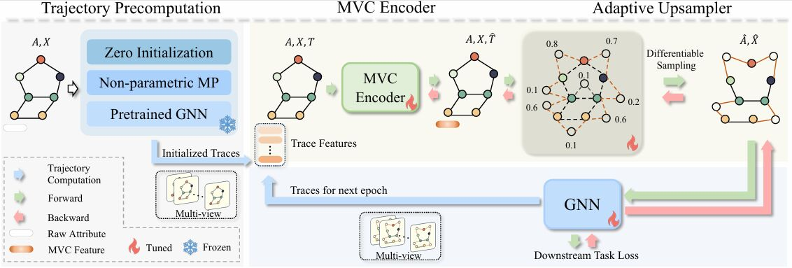

# UniGAP: A Universal and Adaptive Graph Upsampling Approach to Mitigate Over-Smoothing in Node Classification Tasks

> This repository is still on progress.

## Fast overview

Framework of UniGAP. There are four main components in UniGAP, including Trajectory Precomputation, Multi-View Condensation (MVC) Encoder, Adaptive Upsampler, and the downstream model. Trajectory Precomputation needs to be performed only once in each task, then MVC, Adaptive Upsampler, and downstream are co-trained to obtain the optimal graph structure.

You can see all the modules used by UniGAP and the workflow in the UniGAP_FastView.py file. This makes it easy for the reader to understand UniGAP as well as to self-modify the modules in the UniGAP framework to implement your own upsampler.

## Hyperparameters settings
You can select the dataset and hyperparameters in ./configs/\<dataset\>/addnode.yaml. Experimental results are reported on the hyperparameter settings below, where we choose the settings that achieve the highest performance on the validation set. We choose hyperparameter grids that do not necessarily give optimal performance, but hopefully cover enough regimes so that each model is reasonably evaluated on each dataset.

- lr $\in \{5e-2,1e-2,5e-3,1e-3,5e-4\}$
- hidden_dim $\in \{16,32,64,128,256\}$
- dropout $\in \{0,0.1,0.2,0.3,0.5,0.8\}$
- weight_decay $\in \{1e-2,5e-3,1e-3,5e-4,1e-4\}$
- activation $\in \{\text{elu},\text{relu},\text{prelu}\}$
- layer_num $\in \{1,2,3,4,5,6,7,8\}$

UniGAP settings：
- Trace_Precompute: zero/mpnn/pre_train
- MVC_Encoder: MLP/TMM/TT
- MVC_dim $\in \{32,64,128,256,512\}$
- MVC_hidden $\in \{32,64,128,256,512\}$
- w $\in \{1,2,3,4,\text{None}\}$

Particularly for GCNII：
- alpha $\in \{0.1,0.2,0.3,0.4,0.5\}$
- theta $=1$

## Runing Commands
you can run UniGAP by
python traditional_gnn.py --config ./configs/<dataset>/unigap.yaml

you can run baselines by
python traditional_gnn.py --config ./configs/<dataset>/gnn.yaml
